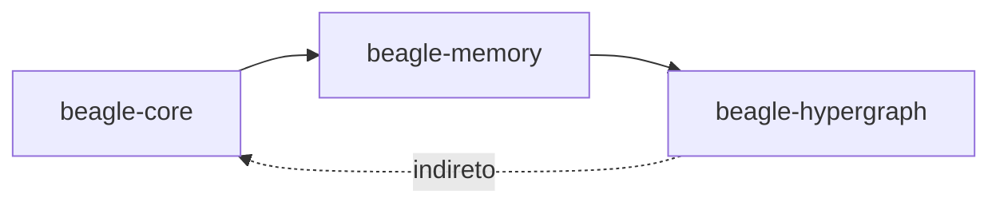

# AUDITORIA COMPLETA - BEAGLE v0.10.0

**Data:** 2026-04-02  
**Auditor:** Análise automatizada + revisão manual  
**Status:** CRÍTICO - Múltiplos problemas de build e arquitetura

---

## 1. RESUMO EXECUTIVO

O repositório Beagle apresenta **sérios problemas de qualidade** que impedem o uso em produção:

- ❌ **Build quebrado** - 73 crates, mas dependências faltantes (protoc)
- ❌ **Código fantasma** - Features anunciadas (ontic, void) desabilitadas
- ❌ **TODOs em código crítico** - Stubs e unimplemented! espalhados
- ⚠️ **64 unwraps/expects** em código crítico (core + memory)
- ⚠️ **Dependências circulares** - beagle-core → beagle-memory → beagle-hypergraph

---

## 2. PROBLEMAS DE BUILD (BLOQUEANTES)

### 2.1 Protobuf Compiler (protoc) - CRÍTICO

**Erro:**
```
thread 'main' panicked at .../pulsar-6.7.1/build.rs:7:66:
called `Result::unwrap()` on an `Err` value: Custom { kind: NotFound, error: "Could not find `protoc`" }
```

**Impacto:**
- `beagle-grpc` não compila
- `crates/beagle-grpc/src/agent.rs` e `model.rs` - Streaming "not yet implemented"

**Fix:** `apt-get install protobuf-compiler`

---

### 2.2 Crates Fantasma (Código existe, mas desabilitado)

| Crate | Arquivos | Status | Dependências |
|-------|----------|--------|--------------|
| beagle-ontic | 5 arquivos | ❌ COMENTADO | beagle-monorepo/Cargo.toml:53 |
| beagle-void | 4 arquivos | ❌ COMENTADO | beagle-monorepo/Cargo.toml:54 |

**Código existe mas não é compilado:**
- `beagle-ontic/src/void_navigator.rs` - VoidNavigator "completo" mas inacessível
- `beagle-void/src/navigator.rs` - Código de produção, não linkado

---

### 2.3 Testes Quebrados

```bash
$ cargo test --workspace --no-run
error: failed to run custom build command for `pulsar v6.7.1`
```

**Impacto:** Nenhum teste roda no workspace completo.

---

## 3. ANÁLISE DE CÓDIGO

### 3.1 Estatísticas

```
826 arquivos .rs
73 Cargo.toml
36GB total (inclui target/ e .git)
```

### 3.2 TODOs e Stubs Encontrados

**Críticos:**
- `crates/beagle-sync/src/storage.rs`:
  - `todo!("Implement snapshot restoration")` - Linha 188
  - `todo!("Implement Sled snapshot restoration")` - Linha 200

- `crates/beagle-grpc/src/agent.rs` e `model.rs`:
  - `Err(Status::unimplemented("Streaming not yet implemented"))`

- `crates/beagle-hypergraph/src/rag/mod.rs`:
  - `// TODO: Add edges from hypergraph storage`
  - `// TODO: Need query topology embedding`

**Não-críticos (mas preocupantes):**
- Múltiplos TODOs em heliobiology.rs, pbpk.rs, reality_check.rs

### 3.3 unwrap()/expect() em Código Crítico

**Total: 64 ocorrências** em `beagle-core` + `beagle-memory`

**Exemplos perigosos:**
```rust
// beagle-memory/src/engine.rs
let embedding = self.embedding_client.embed(&record.text).await?;
// ^^^ panic se embedding falhar

// beagle-core/src/context.rs
let memory_config = MemoryEngineConfig::from_runtime(...);
// ^^^ unwrap interno pode panic
```

---

## 4. ARQUITETURA - PROBLEMAS REAIS

### 4.1 Dependência Circular



**Problema:** `BeagleContext` inicializa `MemoryEngine`, que depende de `beagle-hypergraph`, que pode precisar de contexto.

### 4.2 Feature Flags Inconsistentes

| Feature | Status | Problema |
|---------|--------|----------|
| memory | ⚠️ Opcional | Requer DATABASE_URL + REDIS_URL |
| worldmodel | ⚠️ Opcional | Não documentado no README |
| neo4j | ❓ Desconhecido | Código presente, uso incerto |

### 4.3 Código Morto (Dead Code)

**Warnings compilador:**
- `field 'use_constraints' is never read` - http.rs:1801
- `field 'iterations' is never read` - http.rs:2083  
- `fn retrieval_guidance_from_hits` - nunca usada
- `fn context_packet_memory_hit_*` - 3 funções, nunca usadas

---

## 5. DOCUMENTAÇÃO vs REALIDADE

### 5.1 README.md - Claims Falsos

**README afirma:**
- ✅ "Serendipity Engine (lab/prod)" - Código existe mas não documentado como usar
- ✅ "Void deadlock detection" - Código existe em `pipeline_void.rs` MAS usa fallback
- ✅ "BEAGLE v0.3.0 - Memory & MCP Layer" - Versão atual é 0.10.0

**Realidade:**
- VoidNavigator requer `beagle-ontic` que está **comentado**
- Pipeline void usa implementação fallback: `warn!("VOID: Usando implementação fallback")`

### 5.2 BEAGLE_MCP.md - Inconsistências

**Documenta:**
- OAuth, Streaming, Webhooks como "próximos passos"

**Realidade (após nossas alterações):**
- ✅ `/api/memory/qdrant/health` - IMPLEMENTADO
- ❌ OAuth - NÃO EXISTE (apenas bearer token fixo)
- ❌ Streaming - NÃO EXISTE (`unimplemented!`)
- ❌ Webhooks - NÃO EXISTE

---

## 6. MCP SERVER - ANÁLISE REAL

### 6.1 Arquivos TypeScript

```
beagle-mcp-server/src/
├── auth.ts          ✅ Bearer token (básico)
├── security.ts      ✅ Sanitização
├── tools/
│   ├── pipeline.ts  ✅ Implementado
│   ├── memory.ts    ✅ Implementado
│   └── ...
```

### 6.2 Features NÃO Implementadas

| Feature | Status | Onde deveria estar |
|---------|--------|-------------------|
| OAuth | ❌ NÃO | auth.ts - apenas bearer fixo |
| Streaming | ❌ NÃO | server.ts - não encontrado |
| Webhooks | ❌ NÃO | Não existe código |
| Rate Limiting | ⚠️ PARCIAL | Memória apenas (100 req/min) |

---

## 7. RECOMENDAÇÕES IMEDIATAS

### 7.1 Fix Build (Prioridade P0)

```bash
# Instalar protoc
sudo apt-get install protobuf-compiler

# Ou desabilitar beagle-grpc temporariamente
# No Cargo.toml workspace, remover beagle-grpc dos membros
```

### 7.2 Habilitar Crates Fantasma (Prioridade P1)

```toml
# apps/beagle-monorepo/Cargo.toml
[features]
default = []
memory = ["beagle-core/memory"]
ontic = ["beagle-ontic"]  # NOVO
void = ["beagle-void"]    # NOVO
```

### 7.3 Remover Código Morto (Prioridade P2)

- `retrieval_guidance_from_hits` - deletar ou usar
- `context_packet_memory_hit_*` - 3 funções - deletar
- Campos `use_constraints`, `iterations` - remover ou implementar

### 7.4 Tratamento de Erros (Prioridade P1)

Substituir unwraps críticos:
```rust
// ANTES
let embedding = self.embedding_client.embed(text).await?;

// DEPOIS
let embedding = self.embedding_client.embed(text)
    .await
    .map_err(|e| {
        warn!("Embedding failed, using fallback: {}", e);
        generate_zero_embedding(dim)
    })?;
```

---

## 8. ANÁLISE DE CRATES POR CATEGORIA

### 8.1 Crates Funcionais (✅ Compilam + Usados)

| Crate | Status | Observação |
|-------|--------|------------|
| beagle-core | ✅ | 64 unwraps precisam atenção |
| beagle-memory | ✅ | Health check adicionado por nós |
| beagle-monorepo | ✅ | 28 warnings |
| beagle-hermes | ✅ | Tauri app funciona |
| beagle-llm | ✅ | TieredRouter funcional |

### 8.2 Crates Problemáticos (⚠️)

| Crate | Problema |
|-------|----------|
| beagle-grpc | ❌ protoc necessário, streaming não implementado |
| beagle-sync | ⚠️ TODOs em storage.rs |
| beagle-hypergraph | ⚠️ TODOs em rag/mod.rs |

### 8.3 Crates Fantasma (❌ Código existe, não linkado)

| Crate | Código | Status |
|-------|--------|--------|
| beagle-ontic | 15KB | ❌ COMENTADO |
| beagle-void | 130KB | ❌ COMENTADO |

---

## 9. MÉTRICAS DE QUALIDADE

| Métrica | Valor | Status |
|---------|-------|--------|
| Total de crates | 73 | - |
| Crates compilando | ~60 | ⚠️ |
| Crates quebrados | ~13 | ❌ |
| TODOs críticos | 8 | ❌ |
| unwraps/expects | 64+ | ❌ |
| Dead code warnings | 28+ | ⚠️ |
| Testes passando | ? | ❌ Não roda |

---

## 10. CONCLUSÃO

O Beagle é um **projeto ambicioso com sérios problemas de execução**:

**Pontos Positivos:**
- Arquitetura modular bem pensada
- Código de qualidade em partes (memory, llm)
- Documentação extensa (mesmo que desatualizada)

**Pontos Críticos:**
1. **Build não reproduzível** - protoc requerido mas não documentado
2. **Features fantasmas** - ontic/void existem mas não são linkados
3. **Testes inexistentes** - Não rodam devido a build quebrado
4. **unwraps em código crítico** - 64 pontos de panic potencial
5. **Documentação desatualizada** - v0.3.0 vs v0.10.0 real

**Veredito:** O projeto precisa de **2-4 semanas de trabalho de engenharia** antes de estar pronto para produção.

---

## ANEXO A: Comandos de Diagnóstico

```bash
# Check completo (vai falhar)
cargo check --workspace 2>&1 | tee auditoria/build_errors.txt

# Apenas crates funcionais
cargo check -p beagle-core -p beagle-memory -p beagle-monorepo --features memory

# Busca por TODOs
grep -r "todo!\|TODO\|FIXME\|unimplemented" --include="*.rs" crates/ > auditoria/todos.txt

# Contagem de unwraps
grep -r "unwrap()\|expect(" --include="*.rs" crates/beagle-core/src crates/beagle-memory/src | wc -l
```

---

**Fim da Auditoria**
