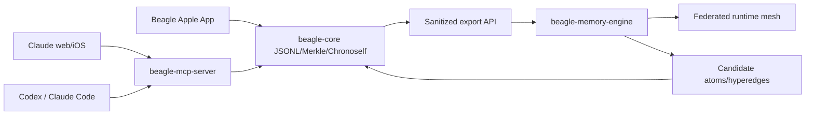

# Beagle Federated Living Memory Engine v1.5

## Position

Beagle v1.5 keeps the founding rule intact: canonical memory is JSONL/Merkle/Chronoself on the cluster PVC `beagle-data`. Every graph, vector, relational, or ontology runtime is a rebuildable index. The new `beagle-memory-engine` is not a second source of truth; it is a federated retrieval mesh, bake-off harness, and candidate-memory workbench.

## Architecture

The memory lab lives in `beagle-memory-lab`. It stores service state on Ceph RBD and heavy artifacts under `/orangefs/beagle-memory-lab`. It never mounts `beagle-data` directly; all data feed comes from `POST /api/exocortex/v1/memory/export`, which rejects `restricted` memory by default.

## Runtime Mesh

Active runtime candidates:

- FalkorDB/GraphBLAS as the primary hypothesis for graph-native retrieval with vector hints.
- Memgraph and SurrealDB as graph/vector comparators.
- ArangoDB, ArcadeDB, Kuzu, LanceDB, DuckDB-VSS, Postgres/pgvectorscale, and TypeDB as federated adapters.
- Neo4j+Qdrant remains a baseline, not the destination.

Promotion criteria are measured, not aesthetic: p95 latency, ingest latency, multi-hop correctness, provenance completeness, rebuild-from-JSONL, operational simplicity, and fit with MCP plus the Apple app.

## Memory Semantics

Candidate atoms and hyperedges are allowed, but they do not enter active Home/search retrieval until promotion. Promotion requires strict Triad quorum:

- Memory voice verifies source/provenance and duplication.
- Temporal voice verifies time, sequence, and drift.
- Critical voice verifies contradiction, overreach, and evidence quality.

Candidate decisions append audit events with provenance, retrieval trace, quorum rationale, and Chronoself links.

## Acceptance Gates

- Zero `restricted` leakage into export, mesh, bake-off artifacts, or promoted responses.
- Every promoted answer includes provenance.
- JSONL replay is idempotent.
- Runtime failure degrades explicitly to internal GraphRAG++/JSONL.
- Claude web/iOS, Codex/Claude Code, and the Beagle app all write/read the same cluster memory.
- `admin:destructive` remains absent from MCP, Apple, and memory-engine surfaces.
